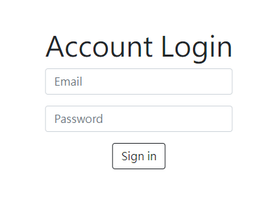
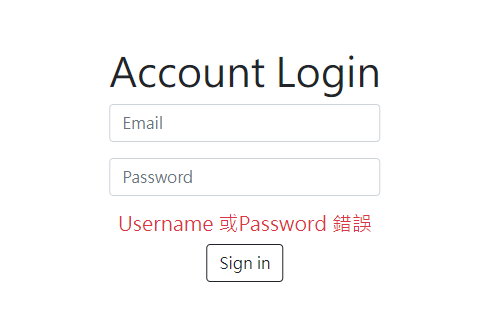

# Easy_Login_System 簡易登入系統

## 開發工具
- Node.js 18.14.1
- Express 4.18.2
- Express-Handlebars 4.0.2

## 使用方式

登入畫面，帳號規定必須輸入信箱格式，密碼會自動讓輸入的數字變成***。



如果帳號或密碼有錯誤，則會跳出錯誤內容。



如果成功登入，畫面會跳出你好的畫面，並會有該帳號的對應名稱。內建的登入帳號密碼在下方附錄。


## 附錄：可登入的帳號密碼與名字列表

```
[
  {
    "firstName": "Tony",
    "email": "tony@stark.com",
    "password": "iamironman"
  },
  {
    "firstName": "Steve",
    "email": "captain@hotmail.com",
    "password": "icandothisallday"
  },
  {
    "firstName": "Peter",
    "email": "peter@parker.com",
    "password": "enajyram"
  },
  {
    "firstName": "Natasha",
    "email": "natasha@gamil.com",
    "password": "*parol#@$!"
  },
  {
    "firstName": "Nick",
    "email": "nick@shield.com",
    "password": "password"
  }
]
```

